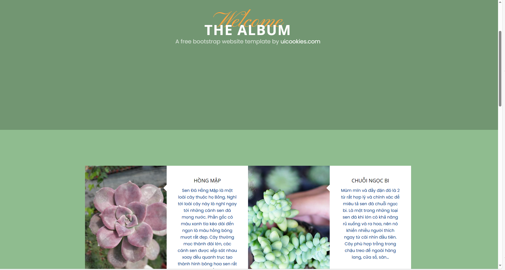

# Web_Succulent

This project is an Ant-based Java web application that allows admins to sell and customers to buy succulents. Users can browse, view details, add to cart, and purchase succulents.

## Highlight

- **Online Plant Store**: Explore a variety of succulents, manage your cart, search for plants, and complete purchases.
- **Comprehensive CRUD Operations**: Efficiently manage users, orders, carts, and products.
- **Tech Stack**: Servlet, JSP, Bootstrap 5, HTML, CSS, JavaScript, and Microsoft SQL Server.

*Note: This is a private project and not intended for public use.*

## Features

### Login


The login page allows guests to join the website.

### Register


The register page allows guests to sign up for an account.

### HomePage


The homepage provides information about the website.

### Shopping


The shopping section shows a list of succulents. Customers can see an overview or detailed view of each plant.

### View Album Succulent




Customers can browse a list of succulents.

### View Succulent Detail


Customers can view detailed information about succulents, including how to grow them and their meanings.

## Prerequisites

### Java Environment

- [Java Development Kit](https://www.oracle.com/java/technologies/downloads) (JDK 17)
- [Apache Tomcat](https://tomcat.apache.org/download-11.cgi) (Tomcat 11)
- [Apache Ant](https://ant.apache.org/bindownload.cgi) (Ant 1.10.14)

### Microsoft SQL Server

- [Microsoft SQL Server](https://www.microsoft.com/en-us/sql-server/sql-server-downloads) (SQL Server 2022 Developer)
- [SQL Server Management Studio (SSMS)](https://learn.microsoft.com/en-us/sql/ssms/download-sql-server-management-studio-ssms) (SSMS 20.1)

*Note: Set the username and password to `sa` and `123` during SSMS setup to match the project's configuration.*

### Development Environment

- **IDE**: [Visual Studio Code](https://code.visualstudio.com/download)
- **Extension**: [Community Server Connector](https://marketplace.visualstudio.com/items?itemName=redhat.vscode-community-server-connector) (for connecting to Tomcat)

*Note: To add Tomcat, use the command palette (Ctrl+Shift+P) and type "Servers: Add Local Server." Select "Tomcat" and choose the directory where Tomcat is installed (CATALINA_HOME).*

## Steps to Run

1. **Clone the Repository**: 
   ```bash
   git clone https://github.com/ntramanh1204/bookstore-web.git
   cd bookstore-web
   ```

2. **Run the SQL Script**: 
   Open `Bookabook.sql` in SSMS and execute it to set up the database schema and initial data.

3. **Start the Tomcat Server**: 
   In the "SERVERS" view on the left of VS Code, right-click on the Tomcat instance and select "Start."

4. **Build and Deploy the Project**: 
   ```bash
   ant run
   ```

5. **Access the Application**: 
   Open your web browser and navigate to `http://localhost:8080` (or your pre-configured port) to use the application.

## Additional Information

The book data for this project was created using Selenium to crawl book information from Goodreads' best books over the years and inserted into the database. The images of the books are located in `web/images/books`. The Jupyter notebook used for this task is `crawl-best-books-final.ipynb`.

## License

This project is private and not licensed for public use. All rights are reserved by the project owner.

## References

- [Themewagon's Fruitable template](https://themewagon.com/themes/fruitables-free/): Bootstrap 5 template used in this project.
- [How to write a README](https://github.com/banesullivan/README): Helpful instructions on crafting a good README.